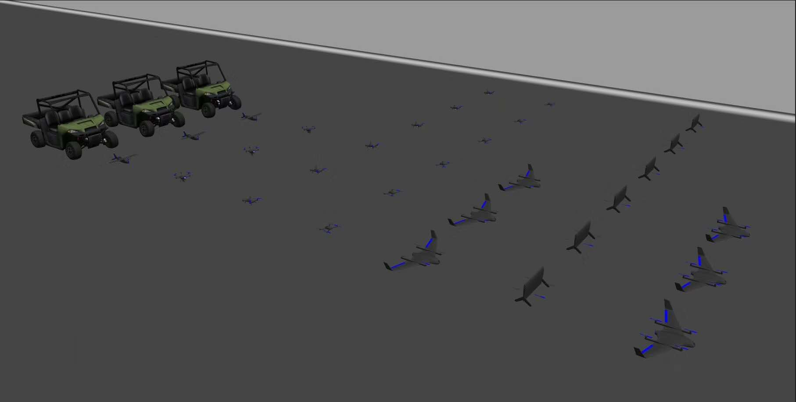
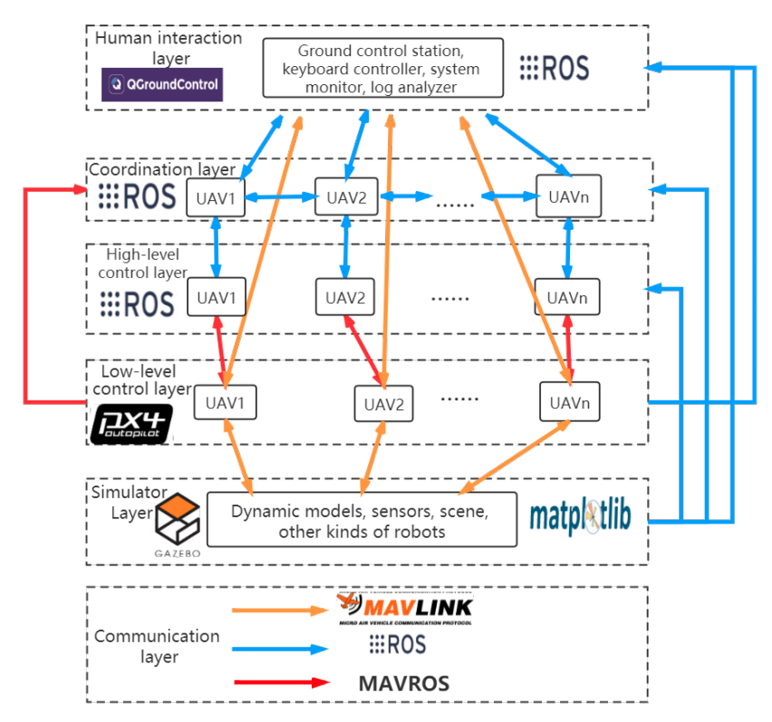
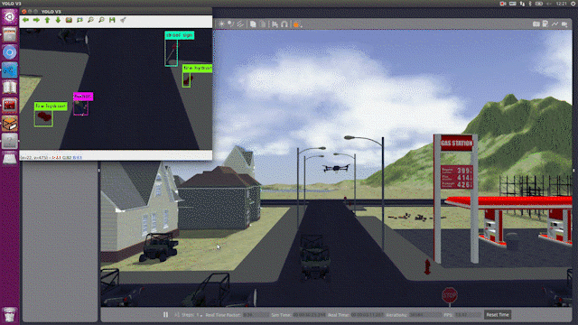
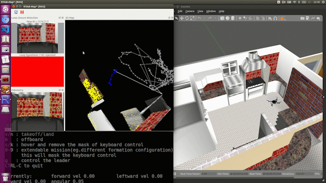
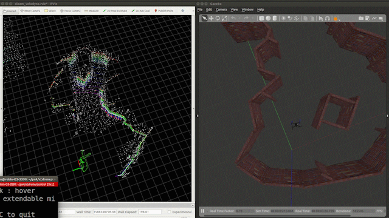
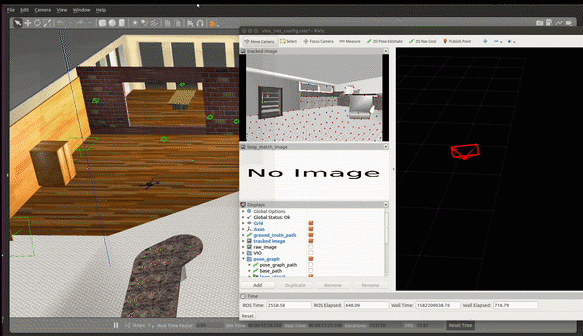
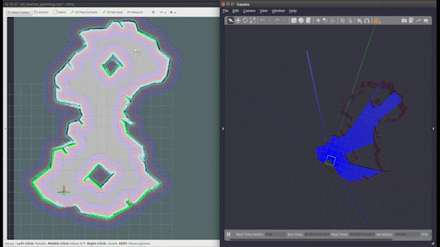
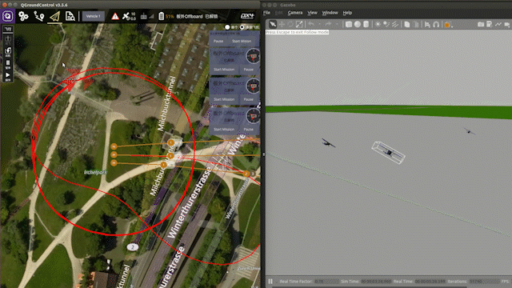
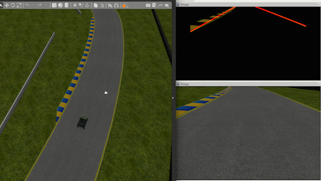

# XTDrone

<a href="./README.md" target="_blank">[中文版]
<a>

#### Description

XTDrone is a customizable Multi-Rotor UAVs simulation platform based on PX4 and ROS. Now the simulator of XTDrone is Gazebo, and the connection to Airsim is being developed. XTDrone supports mulitrotors (including quadrotors and hexarotors), fixed wings, VTOLs (including quadplanes, tailsitters and tiltrotors) and rovers. It's convenient to deploy the algorithm to real UAVs after testing and debugging on the simulation platform.

 

Architecture for single vehicle simulation is shown as the below figure.  For more details, see the paper

Xiao, K., Tan, S., Wang, G., An, X., Wang, X., Wang, X.: Xtdrone: A customizable multi-rotor uavs simulation platform. arXiv preprint **[ arXiv:2003.09700](https://arxiv.org/abs/2003.09700)** (2020)

  

Architecture for multiple vehicle simulation is shown as the below figure.  For more details, see the paper

Xiao, K., Ma, L., Tan, S., Cong, Y., Wang, X.: Implementation of UAV Coordination Based on a Hierarchical Multi-UAV Simulation Platform. arXiv preprint **[ arXiv:2005.01125](https://arxiv.org/abs/2005.01125)** (2020)

  

Developers can quickly verify algorithms with XTDrone, such as:

1. Object Detection and Tracking

 

2. Stereo SLAM

 

3. RGBD-SLAM

 

4. 2D Laser SLAM

 

5. 3D Laser SLAM

  

6. VIO 

  

7. Motion Planning

  

8. Formation

  

  

9. Fixed wing

  

10. VTOLs

  

11. Self driving

  

#### User manual

 [XTDrone Manual](https://www.yuque.com/xtdrone/manual_en)

#### Developing Team

- Founders: Kun Xiao, Shaochang Tan
- Developers: Kun Xiao, Shaochang Tan, Guanzheng Wang, Lan Ma, Qipeng Wang, Ruoqiao Guan, Keyan Chen, Gao Chen

#### Thanks to Contributers

Changhao Sun, Yao He