
<a href="./README.en.md" target="_blank">[ENGLISH]
<a>

### 介绍
XTDrone是基于PX4、ROS与Gazebo的无人机通用仿真平台。支持多旋翼飞行器（包含四轴和六轴）、固定翼飞行器、复合翼飞行器（包含quadplane，tailsitter和tiltrotor）与其他无人系统（如无人车、无人船与机械臂）。在XTDrone上验证过的算法，可以方便地部署到真实无人机上。

单机仿真架构如下图所示，详见论文

K. Xiao, S. Tan, G. Wang, X. An, X. Wang and X. Wang, "XTDrone: A Customizable Multi-rotor UAVs Simulation Platform," 2020 4th International Conference on Robotics and Automation Sciences (ICRAS), 2020, pp. 55-61, doi: 10.1109/ICRAS49812.2020.9134922. 

预印版 **[ arXiv:2003.09700](https://arxiv.org/abs/2003.09700)** 

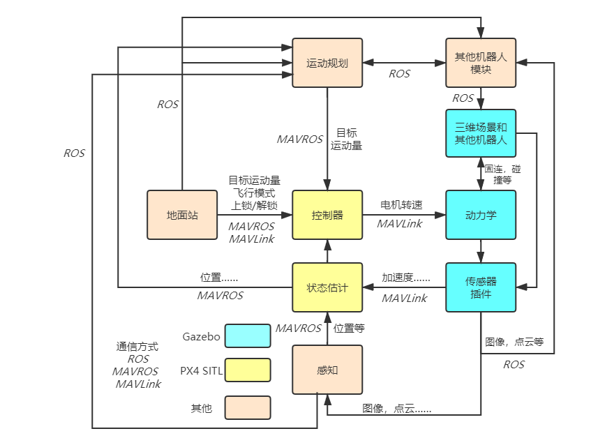 

多机仿真架构如下图所示，详见论文 

K. Xiao, L. Ma, S. Tan, Y. Cong , X. Wang, "Implementation of UAV Coordination Based on a Hierarchical Multi-UAV Simulation Platform," Advances in Guidance, Navigation and Control. Lecture Notes in Electrical Engineering, 2022, vol 644. Springer, Singapore. doi: 10.1007/978-981-15-8155-7_423

预印版 **[ arXiv:2005.01125](https://arxiv.org/abs/2005.01125)** (2020)

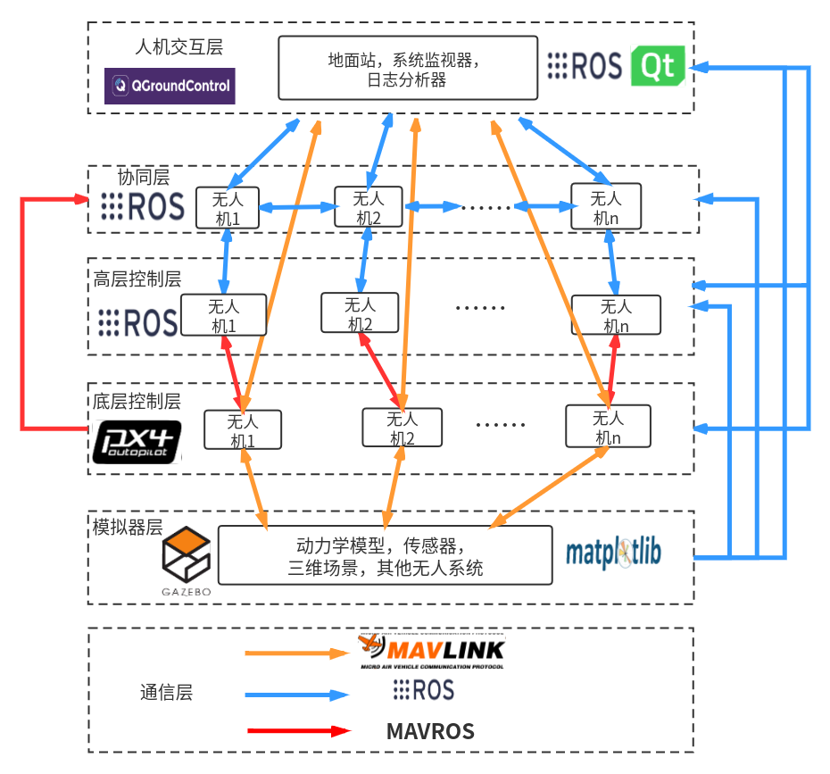

如果使用XTDrone用于学术论文的仿真验证，请引用上述的其中一篇论文。

在这个平台上，开发者可以快速验证算法。如：

双目SLAM

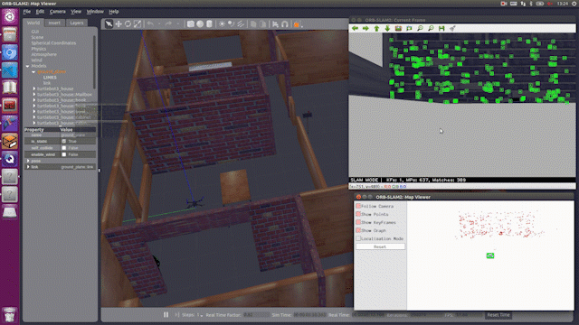 

视觉惯性导航

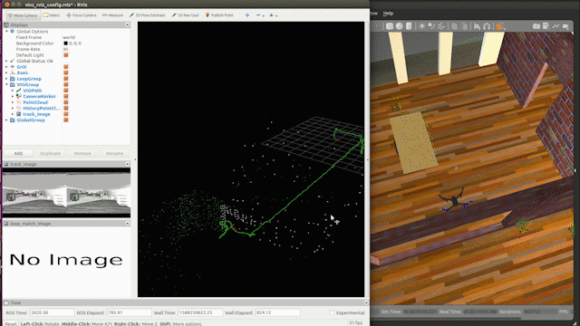  

视觉稠密重建

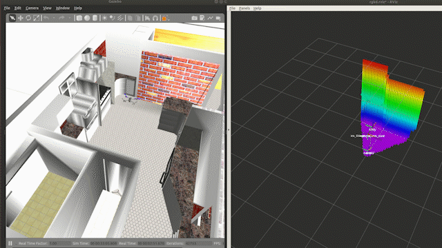 

2D激光SLAM

 

3D激光SLAM

  

2D运动规划

  

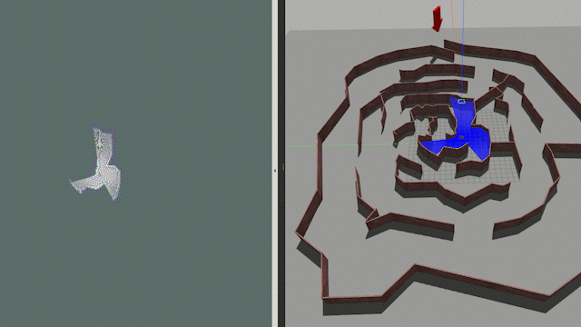  

3D运动规划

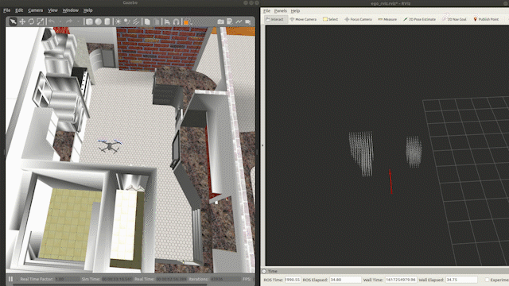  

集群运动规划

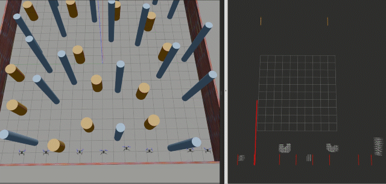  

目标检测与追踪

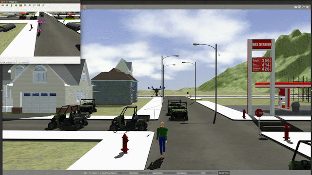 

多机编队

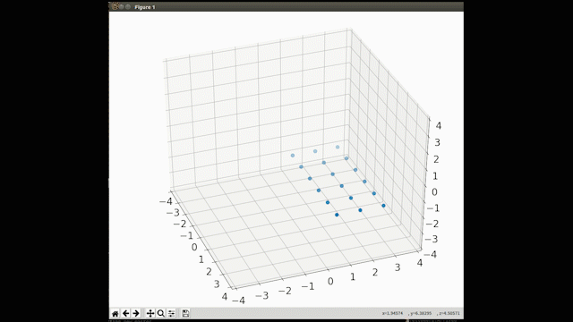  

  

多机精准降落

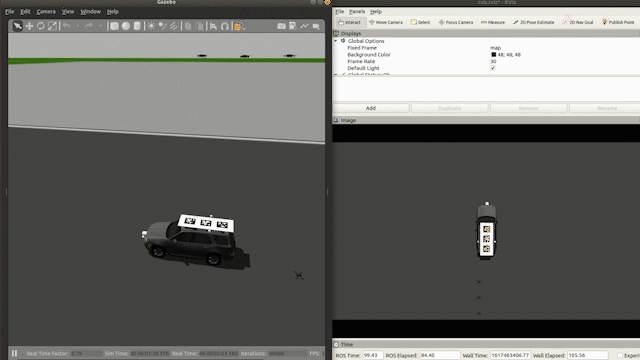  

固定翼

  

复合翼

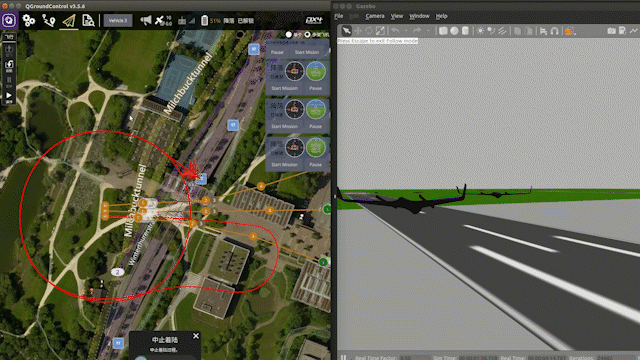  

无人车

  

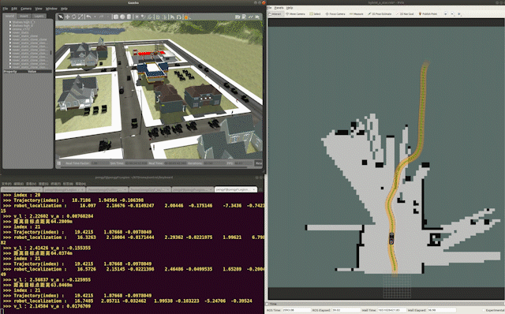 

无人船

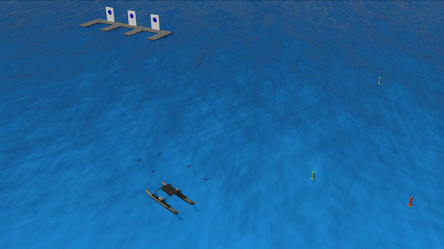  

### 教程

见[XTDrone使用文档](https://www.yuque.com/xtdrone/manual_cn)

### 项目团队

- 创立者：肖昆，谭劭昌
- 指导老师：王祥科
- 开发团队：肖昆，谭劭昌，王冠政，马澜，李玙珂，王齐鹏，胡新雨，吴欣宁，郑家驿，彭羽凡，郑子君，颜佳润，易丰，管若乔，胡文信，鲍毅，卓安，刘旭东，闵洁

### 加入我们

欢迎广大无人机开发者们加入我们的团队，共同学习进步。如有意向，请把简历（包含对PX4 ROS与Gazebo的掌握情况）发到robin_shaun@foxmail.com，让我们一起完善XTDrone仿真平台。

### 贡献者

非常感谢你们为XTDrone的贡献

陈科研，许江伟，卢永光，陈皋，孙长浩，聂莹，孔凡杰，李超然，李旭东，张华卿，林梓涵，何瑶 

### 中国机器人大赛无人机挑战赛仿真组

2022 中国机器人大赛已完成比赛，比赛详情见[官网](http://crc.drct-caa.org.cn/index.php/race/view?id=879)，其中无人机挑战赛仿真组的平台使用XTDrone。2023无人机仿真组将继续由XTDrone团队筹备，届时欢迎大家积极报名，展示自己的风采。

### “智航杯”全国无人机智能算法竞赛

“智航杯”全国无人机智能算法竞赛，由航空工业智航院、中国光华科技基金会联合主办，目前正在报名阶段，比赛详情见[官网](https://zhihangcup.chilunyc.com/)，其中仿真赛项的平台使用XTDrone，欢迎大家积极报名，展示自己的风采。

### 合作

如果想与XTDrone团队建立合作，请联系肖昆<robin_shaun@foxmail.com>。
