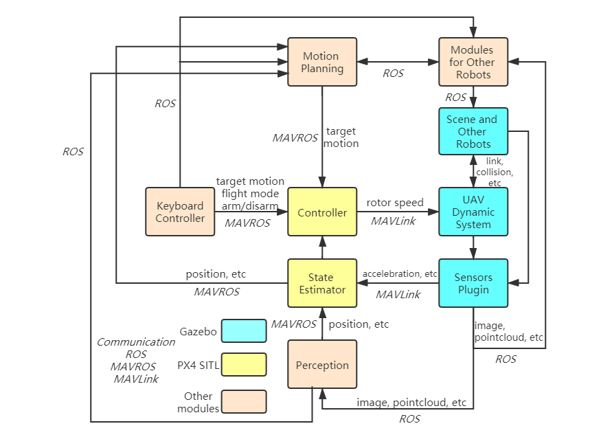
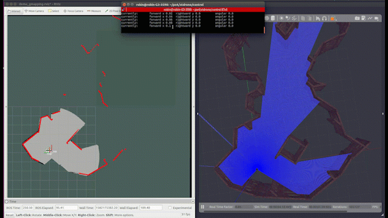
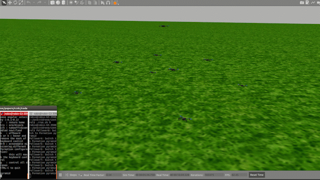

# XTDrone

<a href="./README.en.md" target="_blank">[ENGLISH]
<a>

#### 介绍
这是基于PX4和ROS的无人机仿真平台(目前模拟器使用Gazebo，与Airsim的连接正在开发中)。

 

在这个平台上，开发者可以快速验证算法。如：

1. 目标检测与追踪
 

2. 视觉SLAM
 

3. 激光SLAM
 

4. VIO 
  

5. 运动规划
  
  
6. 多机协同
  

#### 软件架构
- 通信: PX4与ROS之间的通信封装进Python类, 多机通信启动多进程
- 控制：键盘切换无人机飞行模式，控制解锁上锁，调节速度和偏航转速
- 感知
  1. 目标检测与追踪
       - YOLO
  2. SLAM：
     1. VSLAM: 
         - ORBSLAM2
     2. Laser_SLAM:
         - PLICP+gmapping
     3. VIO
         - VINS-Mono（起飞前初始化问题有待完善）
  3. 位姿真值获取
  4. 语音识别（待开发）
- 运动规划(目前只有二维)
  1. 全局规划
      - A*
      - Dijkstra
  2. 局部规划
      - DWA
- 协同：多机编队构型变换。提供简易3D仿真器，加快算法验证。
- 仿真配置
  1. 无人机PX4参数
     - 可拒止GPS和磁罗盘
  2. 启动脚本
  3. Gazebo模型
     - 支持双目相机、深度相机、单线雷达和多线雷达 
  4. Gazebo世界
     - 两个户外场景
     - 三个室内场景

#### 安装教程

见[XTDrone使用文档](https://www.yuque.com/xtdrone/manual_cn)

#### 项目团队

- 创立者：肖昆，谭劭昌
- 开发团队：肖昆，谭劭昌，王冠政，马澜，王齐鹏，陈科研

#### 感谢贡献者们

孙正浩
何瑶
