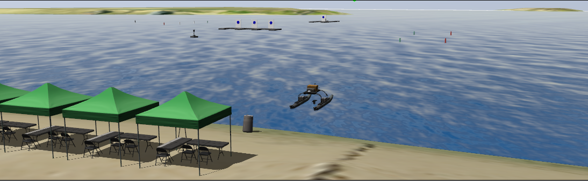

# Virtual RobotX (VRX)

This repository is the home to the source code and software documentation for the VRX Simulation and the VRX Challenge.  [Challenge documentation](https://github.com/osrf/vrx/wiki/documentation) is available on the project wiki, including links to registration information and documentation of the tasks and technical specifications.
  
This is an active development project.  We are adding and improving things all the time.  The project contains a simulation foundation, including an environment similar to the RobotX venue and description of the WAM-V platform.  It is intended as a first step for teams that would then extend the tools for their specific development needs.





## Getting Started

 * Watch the [Release 1.2 Highlight Video](https://youtu.be/0Q2ehhmSz0Q)
 * The [VRX Wiki](https://github.com/osrf/vrx/wiki) provides documentation and tutorials.
 * The instructions assume a basic familiarity with the ROS environment and Gazebo.  If these tools are new to you, we recommend starting with the excellent [ROS Tutorials](http://wiki.ros.org/ROS/Tutorials)
 * For technical problems, please us the [project issue tracker](https://github.com/osrf/vrx/issues) to describe your problem or request support. 

## Reference

If you use the VRX simulation in your work, please cite our summary publication, [Toward Maritime Robotic Simulation in Gazebo](https://wiki.nps.edu/display/BB/Publications?preview=/1173263776/1173263778/PID6131719.pdf): 

```
@InProceedings{bingham19toward,
  Title                    = {Toward Maritime Robotic Simulation in Gazebo},
  Author                   = {Brian Bingham and Carlos Aguero and Michael McCarrin and Joseph Klamo and Joshua Malia and Kevin Allen and Tyler Lum and Marshall Rawson and Rumman Waqar},
  Booktitle                = {Proceedings of MTS/IEEE OCEANS Conference},
  Year                     = {2019},
  Address                  = {Seattle, WA},
  Month                    = {October}
}
```

## Contributing

The simulation tools under active development to support the RobotX teams.  We are starting simple with the important fundamental aspects of the robot and environment, but will rely on the community to develop additional functionality around their particular use cases.

If you have any questions about these topics, or would like to work on other aspects, please contribute.  You can contact us directly (see below), submit an [issue](https://github.com/osrf/vrx/issues) or, better yet, submit a [pull request](https://github.com/osrf/vrx/pulls/)!

## Contributors

We continue to receive important improvements from the community.  We have done our best to document this on our [Contributors Wiki](https://github.com/osrf/vrx/wiki/Contributors).

## Contacts

 * Carlos Aguero <caguero@openrobotics.org>
 * Brian Bingham <bbingham@nps.edu>
